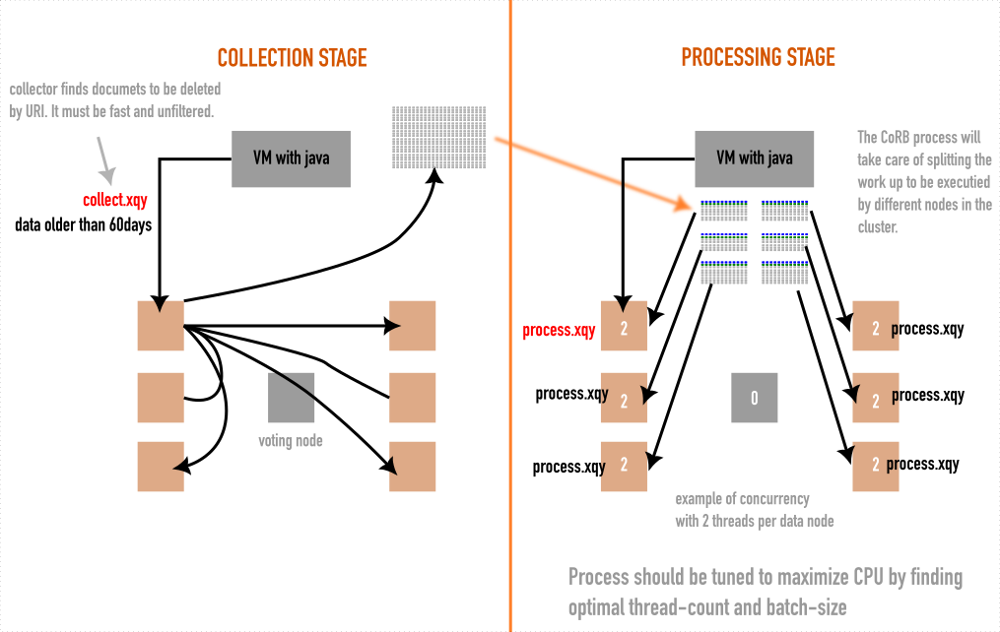

# CoRB data purging in MarkLogic 

This repo provides a ready to run data purge CoRB script. It uses CoRB to quickly find and remove documents from your database.

Adjust to your needs. Test fully and use with care.

Note: if your db is correctly configured, you may consider using collection deletes (`xdmp:collection-delete`) to remove data. However, in certain cases this can be slow than one-by-one deletions, so use be sure to test.

## Overview

The following image shows how CoRB can use used to delete documents pretty quickly.

# Setup up environment

Copy `ml_env.sh.template` to `ml_env.sh` and update the values to match your environment.

    cp ml_env.sh.template ml_env.sh
    vim ml_env.sh

# Running the script

From the TOP LEVEL directory ...

First, source your environement so the required variables are defined:

    source ./ml_env.sh

Then, set cutoff date and execute:

    cutoff_date="2022-01-01"
    bash src/start-purge.sh "$cutoff_date"
